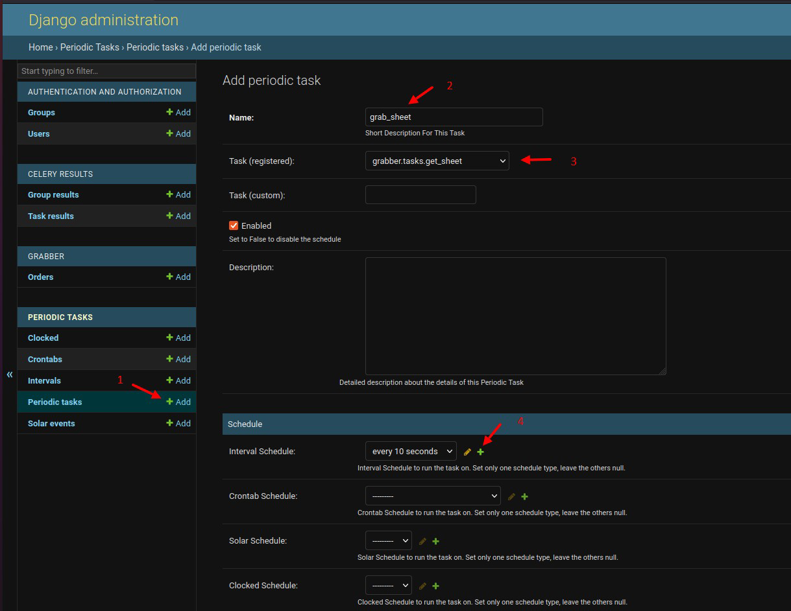

# SheetGrabber

## Запуск

### 1. Запуск контейнеров
```
docker-compose up --build
```

### 2. Создать админа
при запущенном docker-compose.
```
python app/manage.py createsuperuser --settings=sheetgrabber.settings.debug_ext
```

### 3. Создать периодическую задачу в админке

1. Создать новую задачу Periodic tasks
2. Придумать название
3. Вызывать задачу grabber.tasks.get_sheet
4. Установить интервал срабатывания

### 4
frontend на react
```
http://127.0.0.1/
```

Вариант из Django (нужно обновлять страницу)
```
http://127.0.0.1:8000/
```

Можно посмотректь DRF
```
http://127.0.0.1:8000/api/orders
```

### Ограничения таблицы
В задании не описываются возможные данные в таблице, поэтому чтобы не делать все как charfield
добавлены следующие ограничения:
1. В первой колонке " № " должно быть целое число
2. В колонке " заказ № " может быть что угодно
3. В колонке " стоимость,$ " должно быть число
4. в колонке " срок поставки " должна быть дата в формате строки дд.мм.гггг

При нарушении строка помечается как не валидная и данные в базу не вносятся.
Сделано как пример.
Все можно доработать после уточнения с "заказчиком" )


### =====
Google sheet
https://docs.google.com/spreadsheets/d/1mx8zoY2IGLzVVWw-yYnxtuHW0ejE7QYV8neu39rmsME/edit#gid=0

Разрабатывалось на:
Python 3.9.12
